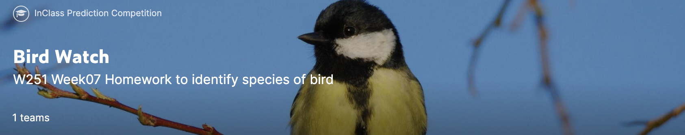

# Lab Week 07 - DL201

**This lab should get you started for the hw07.**

  

### Instructions 
  
We will demonstrate a few concepts from [this](https://arxiv.org/abs/1812.01187?utm_source=feedburner&utm_medium=feed&utm_campaign=Feed%3A+arxiv%2FQSXk+%28ExcitingAds%21+cs+updates+on+arXiv.org%29) paper, please try to read it over the next week.  
    
Before starting, if you do not have it, you need to sign up to the kaggle platform and sign up to the [competition page](https://www.kaggle.com/competitions/bird-watch-summer-2022) - see the data tab.
    
In [this](https://www.kaggle.com/dmitryrekesh/week07-lab-fork-me?scriptVersionId=87863149) notebook we cover a few of the concepts to improve training in Image classification. You will need to copy and edit the [linked notebook](https://www.kaggle.com/dmitryrekesh/week07-lab-fork-me?scriptVersionId=87863149) (menu in top right corner). 
  
First run through all the steps to the end of the initial set up section.  
  
After the initial section, there are a number of topics to cover, chose any one of them to start and see if you can answer the questions asked. For all except the architectures section, there should be a corresponding section descriping it in the paper referenced.   
      
Good luck! 
