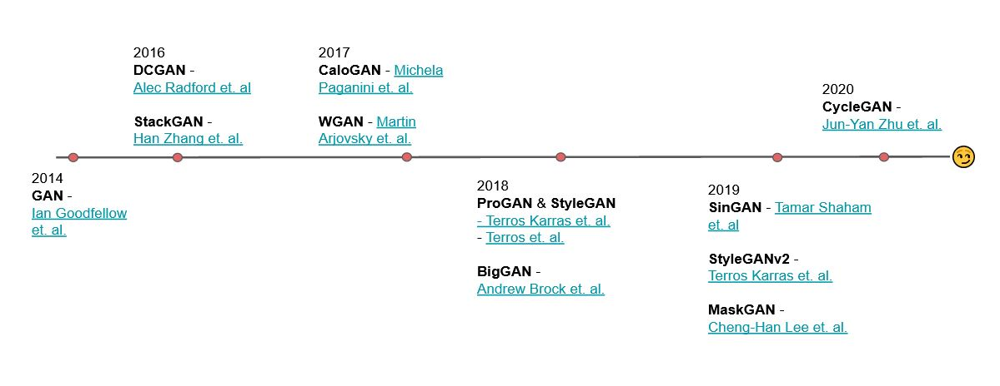

# GANs refined
In this week's lab, you used a GAN to generate images of people that look like celebrities.

For this homework, you will pick one of the GAN notebooks in this GitHub repo and modify it to improve the quality of the output: DCGan (the lab), Super Resolution GAN (SRGAN) and GauGAN. Look over the concepts, try to modify the parameters and observe the output. You will likely need to provision a T4-powered VM in the cloud to complete this work.

### Submission:
1. What changes did you make to the notebook[s]? Did your changes result in lower losses?
2. In your own words, how does the Discriminator improve its ability to detect fakes?
3. Share a copy of the output image from the last step in the notebook (can be an upload to the ISVC Portal, or a link to the file in AWS Object Store).

### GAN timeline

### GAN use cases

These are some use cases for GAN applications. However, note that there are cons associated with all of these applications. We urge you to be mindful with this new knowledge.

- GAN for Data Augmentation: generate more labeled examples ([example](https://www.nature.com/articles/s41598-019-52737-x))
- GAN for Privacy: Train only on GAN generated images as compared to using real patient data ([example](https://www.ahajournals.org/doi/full/10.1161/CIRCOUTCOMES.118.005122))
- GAN for Anonymity: Safe environment for expressions ([example](https://github.com/hukkelas/DeepPrivacy))
- GAN for Arts: Turn doodles into photorealistic landscapes ([example](https://github.com/NVlabs/SPADE))
- GAN for Super Resolution: Image-to-Image translation 
- GAN for Talking Heads: Image-and-Landmark-to-Video ([example](https://github.com/vincent-thevenin/Realistic-Neural-Talking-Head-Models))

And many more...
