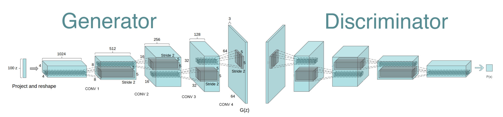

# GANs Lab
In this lab, you will create images of people who resemble celebrities. We are using the [Celeb-A Faces dataset](http://mmlab.ie.cuhk.edu.hk/projects/CelebA.html) and referencing code created by Nathan Inkawhich <https://github.com/inkawhich>.

Load the Python Notebook from Github (dcgan_faces.ipynb) into Colab. Ensure that your runtime is using a GPU.

Follow the notebook to create a set of celebrity faces. Observe how the Generator and Discriminator neural networks are built. Discuss differences between the two neural network designs.

Questions to keep you on track:
* What is the size of the dataset? What are the image dimensions?
* What is the batch size during training? Can you increase it?
* How are the weights initialized?
* How are the losses calculated? What is the ideal discriminator D(x) loss? D(G(x)) loss? 
* What are the two D(G(z)) losses?
* What is the ideal G(z) generator loss?
* What is the intuition for the nz?
* What would be the 'bag of tricks' approaches that could be used to improve results?
